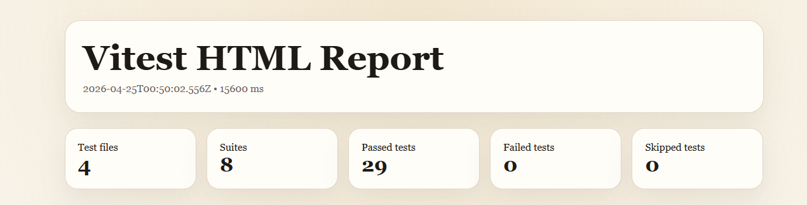
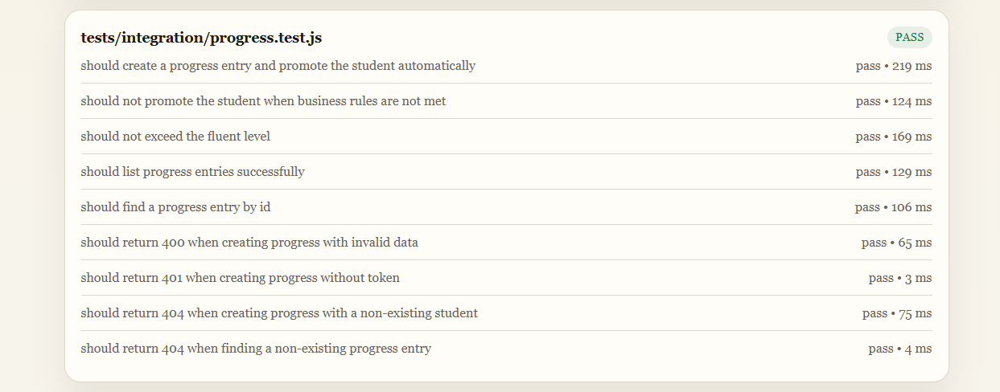

# 🚀 API Escola de Inglês - Backend com Node.js, Prisma e Testes de Integração


---

## 🧠 Sobre o projeto

API REST desenvolvida para gerenciamento de alunos de uma escola de inglês.

O projeto foi construído com foco em boas práticas de backend, incluindo autenticação, validação, testes automatizados e documentação.

---

## ⭐ Diferenciais

* 🔐 Autenticação com JWT
* 🧪 Testes de integração com Vitest e Supertest
* 🗄️ Banco de dados PostgreSQL com Docker
* ⚙️ ORM Prisma
* 📄 Documentação interativa com Swagger
* ✅ Validação robusta com Zod
* 🧱 Arquitetura organizada (controllers, services, middlewares)

---

## 🛠 Tecnologias utilizadas

* Node.js
* Express
* PostgreSQL
* Prisma ORM
* Docker
* JWT (JSON Web Token)
* Zod
* Vitest + Supertest
* Swagger (OpenAPI)

---

## ⚙️ Como rodar o projeto

### 1. Clonar o repositório

```bash
git clone https://github.com/AndyTex2003/projeto-portifolio-pessoal-mt3.git
cd projeto-portifolio-pessoal-mt3
```

### 2. Instalar dependências

```bash
npm install
```

### 3. Subir o banco com Docker

```bash
docker start postgres-db
```

### 4. Rodar migrations

```bash
npx prisma migrate deploy
```

### 5. Rodar seed

```bash
npm run prisma:seed
```

### 6. Iniciar a API

```bash
npm run dev
```

---

## 🔐 Autenticação

Usuário padrão para testes:

```json
{
  "email": "admin@escola.com",
  "password": "admin123"
}
```

---

## 📄 Documentação da API

Acesse via navegador:

```
http://localhost:3000/api-docs
```

---

## 🧪 Testes

Rodar testes de integração:

```bash
npm test
```

### ✔ Cobertura

* Sucesso (200 / 201)
* Validação (400)
* Autenticação (401)
* Não encontrado (404)
* Regras de negócio (evolução de nível)

---

## 📊 Relatório de Testes

O projeto possui testes de integração cobrindo autenticação, alunos, aulas e regras de negócio.

### 🔍 Visão Geral



### 📈 Regra de Negócio - Evolução de Nível



---

## 📌 Estrutura do projeto

```
src/
  controllers/
  services/
  routes/
  middlewares/
  validators/
  config/

prisma/
tests/
docs/
```

---

## 🚀 Endpoints principais

### Auth

* POST /api/auth/login

### Students

* GET /api/students
* POST /api/students
* PUT /api/students/:id
* DELETE /api/students/:id

### Lessons

* GET /api/lessons
* POST /api/lessons
* GET /api/lessons/:id
* PUT /api/lessons/:id
* DELETE /api/lessons/:id

### Progress

* GET /api/progress
* POST /api/progress
* GET /api/progress/:id

---

## 🧪 Qualidade

A API foi desenvolvida com foco em confiabilidade, incluindo:

* Testes de integração isolados
* Dados independentes por teste
* Limpeza automática de dados com Prisma
* Validação de entrada com Zod
* Regras de negócio testadas (evolução de nível)

---

## 🎯 Objetivo

Este projeto foi desenvolvido para prática e demonstração de:

* Desenvolvimento backend com Node.js
* Testes automatizados de API
* Integração com banco de dados
* Boas práticas de arquitetura
* Pensamento de QA (testes + validação + regras de negócio)

---

## 👨‍💻 Autor

**Anderson Santos**
🔗 https://www.linkedin.com/in/anderson-santos-qa/

